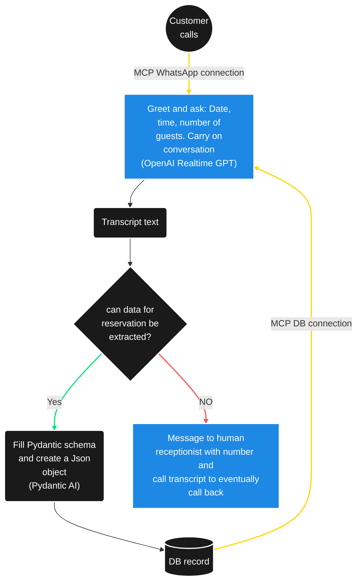

# Hotel Receptionist Voice Bot

AI-powered hotel receptionist voice bot using OpenAI Realtime API for multilingual customer service.

## Project Summary

This project implements an intelligent voice assistant designed specifically for hotel reception services. The bot leverages OpenAI's Realtime API to provide seamless, multilingual customer interactions, handling common hotel inquiries, bookings, and guest services with natural voice conversations.

### Key Features

- **Multilingual Support**: Handles customer inquiries in multiple languages
- **Real-time Voice Processing**: Uses OpenAI Realtime API for natural conversations
- **Automatic Translation**: Transcripts are automatically translated to English for staff review while preserving original text
- **Hotel-specific Knowledge**: Trained on common hotel services and procedures
- **24/7 Availability**: Provides round-the-clock customer service
- **Integration Ready**: Designed to integrate with existing hotel management systems

## System Architecture



Key Capabilities:

Real-Time Multilingual Support: Utilizing OpenAI’s Realtime GPT infrastructure, the bot automatically detects and engages with guests in their preferred language (such as English, Spanish, French, German, Italian, etc.), enabling smooth communication regardless of guest origin.

Conversational Automation: Capable of answering common questions (room availability, amenities, booking status), making and modifying reservations, offering local recommendations, and processing service requests via phone calls or smart device interfaces.

Personalization & Context Retention: Remembers guest preferences, understands hotel-specific terminology, and adapts its style to maintain a warm, “human-like” engagement. Guest profiles and conversational context are retained across multiple interactions.

Continuous Quality Assurance: Logs all dialogues, analyzes guest satisfaction sentiment in real time, and flags interactions for review if issues arise, enabling continuous service improvement and staff training.

Seamless Human Handover: The bot automatically transfers complex, highly emotional, or sensitive guest requests to human receptionists when needed, ensuring no scenario is left unresolved.

## Return on Investment (ROI) & Impact:

Cost Savings: Reduces front desk staffing costs by up to 49%, with many hotels reporting breaking even on their initial AI investment within 4–8 months.

Productivity: Handles >80% of routine calls and queries, cutting average wait times by 31% and freeing staff for more valuable, high-touch interactions.

Revenue Generation: Immediate response rates boost booking conversion by 15–25%, while personalized upselling (spa packages, room upgrades, tours) can yield thousands in extra monthly profit.

Guest Satisfaction: 24/7 instant support and multilingual service raise guest satisfaction scores by 5–10 points, improving reviews and loyalty.

Quality Assurance: Automated call logging and sentiment tracking enable continuous optimization; prompt engineering and seasonal content updates boost both ROI and guest engagement.

Scalability: The solution easily supports hotels of any size, handling high call volumes and fluctuating demand without additional hiring.


## Typical KPI estimated outcomes:

49% reduction in staffing costs (e.g., from $215,000 to $110,000 annually for a boutique hotel)

Booking conversion rate increase: 62% → 78%

Cut in average response/wait time: 31%

Satisfaction boost: +5–10 points in guest CSAT scores

Multilingual support: 6+ languages handled natively in real-time

## Technologies Used

- **OpenAI Realtime API**: For voice processing and natural language understanding
- **Python**: Core application development
- **WebSocket**: Real-time communication

## Getting Started

### Prerequisites

- Python 3.11+
- OpenAI API key
- Audio input/output capabilities

### Installation

```bash
git clone https://github.com/opsabarsec/hotel-receptionist-voice-bot.git
cd hotel-receptionist-voice-bot
pip install -r requirements.txt
```

### Configuration

1. Set your OpenAI API key in environment variables:
```bash
export OPENAI_API_KEY='your-api-key-here'
```

2. Run the bot:
```bash
python bot_main.py
```

### Transcript Output

After each conversation, the bot automatically generates three transcript files:

- **Original transcript** (`hotel_conversation_TIMESTAMP.txt`): Conversation in the original language(s)
- **Bilingual transcript** (`hotel_conversation_TIMESTAMP_bilingual.txt`): Side-by-side original and English translation
- **JSON transcript** (`hotel_conversation_TIMESTAMP.json`): Structured data with all metadata including detected languages

To disable automatic translation, modify `bot_main.py`:
```python
logger = TranscriptLogger(enable_translation=False)
```


## License

MIT License - see LICENSE file for details.

## Contributing

Contributions are welcome! Please feel free to submit a Pull Request.
