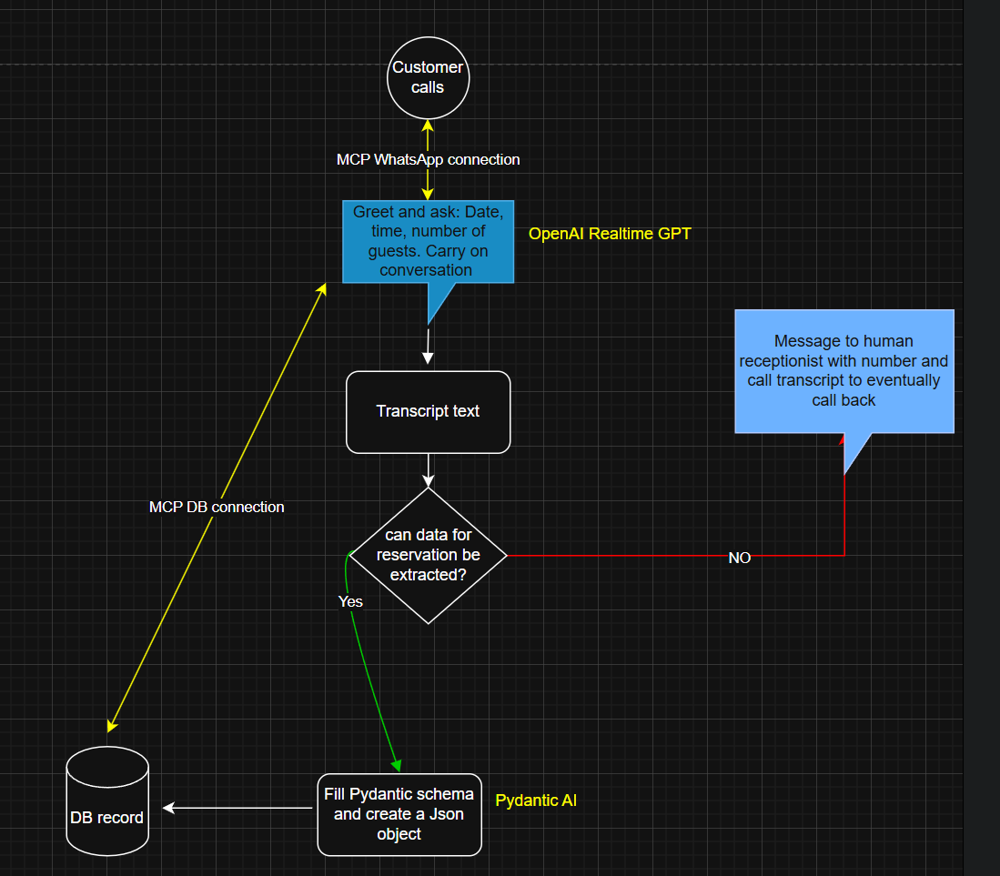

# Hotel Receptionist Voice Bot

AI-powered hotel receptionist voice bot using OpenAI Realtime API for multilingual customer service.

## Project Summary

This project implements an intelligent voice assistant designed specifically for hotel reception services. The bot leverages OpenAI's Realtime API to provide seamless, multilingual customer interactions, handling common hotel inquiries, bookings, and guest services with natural voice conversations.

### Key Features

- **Multilingual Support**: Handles customer inquiries in multiple languages
- **Real-time Voice Processing**: Uses OpenAI Realtime API for natural conversations
- **Hotel-specific Knowledge**: Trained on common hotel services and procedures
- **24/7 Availability**: Provides round-the-clock customer service
- **Integration Ready**: Designed to integrate with existing hotel management systems

## System Architecture



## Key Performance Indicators (KPIs)

### Operational Metrics
- **Response Time**: < 2 seconds average response time
- **Language Coverage**: Support for 10+ languages
- **Accuracy Rate**: 95% accurate response to common inquiries
- **Availability**: 99.9% uptime

### Customer Experience
- **Customer Satisfaction**: Target 4.5/5 rating
- **Call Resolution**: 80% first-call resolution rate
- **Queue Reduction**: 60% reduction in wait times
- **Cost Efficiency**: 40% reduction in staffing costs

### Technical Performance
- **Latency**: < 500ms voice processing latency
- **Concurrent Users**: Support for 100+ simultaneous conversations
- **Error Rate**: < 2% system error rate
- **Integration Time**: < 1 week deployment to existing systems

## Technologies Used

- **OpenAI Realtime API**: For voice processing and natural language understanding
- **Python**: Core application development
- **WebSocket**: Real-time communication
- **Docker**: Containerized deployment

## Getting Started

### Prerequisites

- Python 3.8+
- OpenAI API key
- Audio input/output capabilities

### Installation

```bash
git clone https://github.com/opsabarsec/hotel-receptionist-voice-bot.git
cd hotel-receptionist-voice-bot
pip install -r requirements.txt
```

### Configuration

1. Set your OpenAI API key in environment variables:
```bash
export OPENAI_API_KEY='your-api-key-here'
```

2. Run the bot:
```bash
python bot_main.py
```

## Documentation

See [index.md](index.md) for detailed documentation and implementation guide.

## License

MIT License - see LICENSE file for details.

## Contributing

Contributions are welcome! Please feel free to submit a Pull Request.
